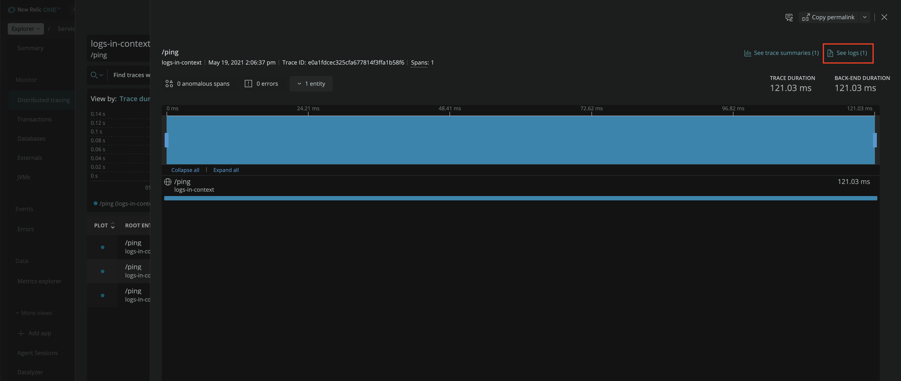

# Logs In Context With Log4j2

## Introduction

This project contains a Java application configured to use [Log4j2](https://logging.apache.org/log4j/2.x/) to write JSON structured logs that propagate OpenTelemetry trace context onto log messages. It also contains a [docker-compose.yaml](./docker-compose.yaml) which illustrates how to forward these logs to an OpenTelemetry Collector, and onto New Relic.

The [log4j2.xml](./src/main/resources/log4j2.xml) configures the application to log out to the console with a [JSON Template Layout](https://logging.apache.org/log4j/2.x/manual/json-template-layout.html) defined in [Log4j2EventLayout.json](./src/main/resources/Log4j2EventLayout.json). The layout follows the [New Relic structured logging conventions](https://github.com/newrelic/newrelic-exporter-specs/tree/master/logging).

The application uses the [OpenTelemetry Log4j2 Integration](https://github.com/open-telemetry/opentelemetry-java-instrumentation/tree/main/instrumentation/log4j/log4j-2.13.2/library) to inject trace context to Log4j2 [thread context](https://logging.apache.org/log4j/2.x/manual/thread-context.html).

The result is JSON structured logs, with one JSON object per line, which have the `span.id` and `trace.id` from OpenTelemetry included:

```json
{
  "timestamp": "2021-05-19T15:51:16.063-05:00",
  "thread.name": "http-nio-8080-exec-1",
  "log.level": "INFO",
  "logger.name": "com.newrelic.app.Controller",
  "message": "A sample log message!",
  "trace.id": "6aae93314fe034149cd85f07eac24bc5",
  "span.id": "f1be31bc6e4471d8"
}
```

## Run

The application runs with Docker, and the [docker-compose.yaml](./docker-compose.yaml) is configured to use the [Fluentd logging driver](https://docs.docker.com/config/containers/logging/fluentd/) to forward logs to an [OpenTelemetry Collector](https://opentelemetry.io/docs/collector/) running as an agent next to the service configured to receive Fluentd logs and forward them to New Relic.

Similar example using FluentBit:


Next, build the application, and run the application with docker compose:

```shell
./gradlew logs-in-context-log4j2:bootJar

docker-compose -f logs-in-context-log4j2/docker-compose.yaml up
```

Exercise logs in context by calling the `GET /ping`, which generated a log message inside the context of a trace:

```shell
curl http://localhost:8080/ping
```

You should be able to see a mix of trace and log data flowing through the collector. If you navigate to the distributed traces of the application in [New Relic One](https://one.newrelic.com/), you should be able to find traces related to the call to `GET /ping`, and see the logs in context:

_Trace With Logs_


_Trace Logs In Context_

